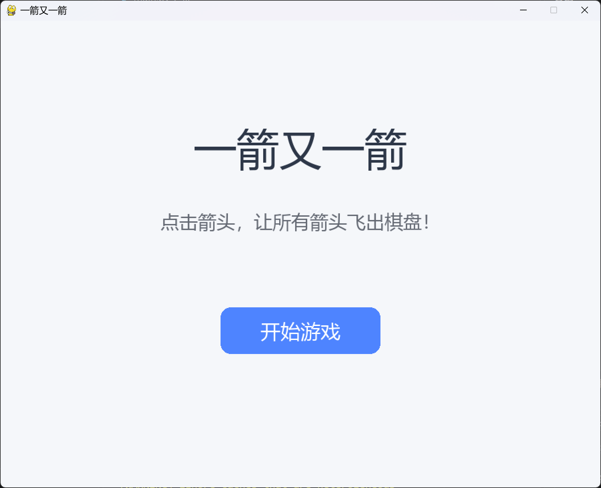
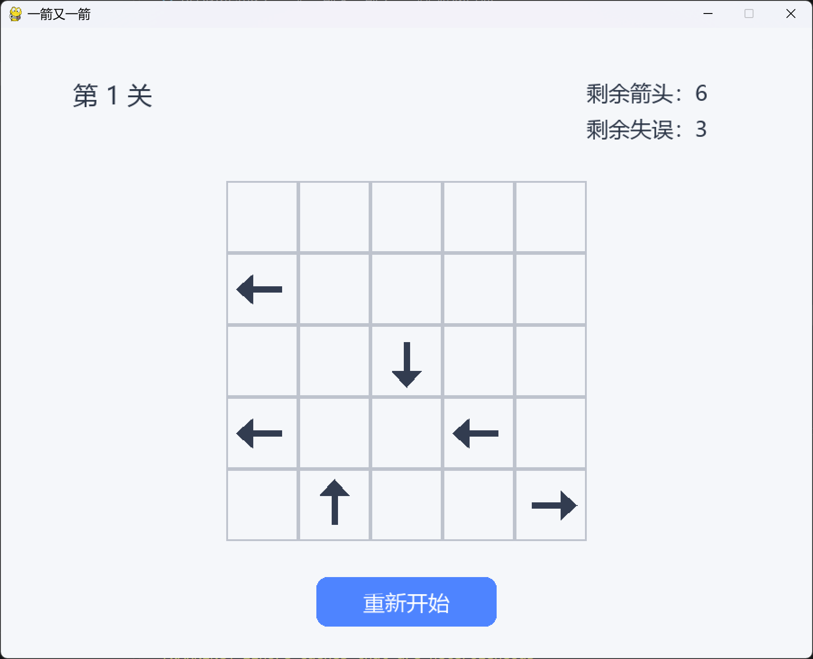
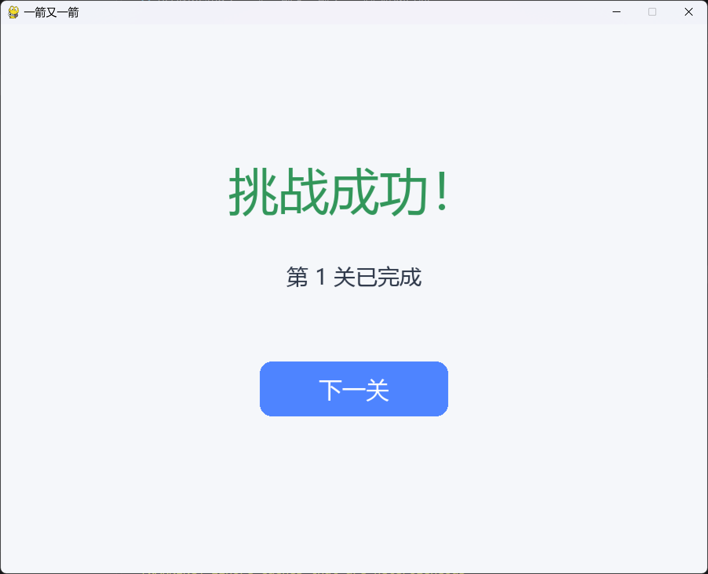
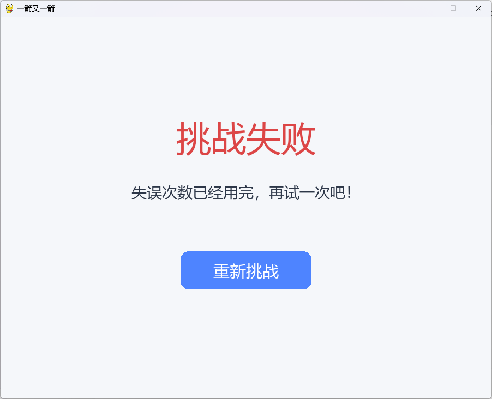

# 一箭又一箭

使用 Python 和 Pygame 开发的点击式箭头解谜小游戏。

## 游戏简介

玩家需要观察箭头的方向以及箭头之间的阻挡关系，按照合适的顺序点击箭头，使所有箭头依次飞出棋盘。

如果箭头前方没有其他箭头阻挡，箭头会沿当前方向飞出棋盘；如果前方存在其他箭头，则会发生碰撞，并消耗一次失误机会。

## 开发环境

- Python 3.13
- Pygame 2.6.1
- Visual Studio Code
- Windows

## 已实现功能

- 开始界面
- 鼠标点击箭头
- 上、下、左、右四种方向
- 四方向路径检测
- 箭头飞出动画
- 碰撞变红和晃动反馈
- 失误次数机制
- 当前关卡重新开始
- 3 个游戏关卡
- 单关通关界面
- 失败界面
- 全部通关界面

## 安装依赖

```bash
pip install -r requirements.txt
```

## 运行方法

```bash
python main.py
```

## 游戏操作

使用鼠标左键点击箭头。

- 如果箭头前方没有其他箭头，则箭头会沿当前方向飞出棋盘；
- 如果箭头前方存在其他箭头，则箭头无法飞出，并会触发红色晃动反馈；
- 每次错误点击会消耗一次失误机会；
- 失误次数耗尽后本关失败；
- 点击“重新开始”可恢复当前关卡；
- 清除当前关卡全部箭头后即可进入下一关；
- 游戏共包含 3 个关卡。

## 游戏目标

在失误次数耗尽之前，按照正确顺序清除棋盘中的全部箭头，并完成全部关卡。
## 游戏截图

### 开始界面



### 游戏界面



### 通关界面



### 失败界面

